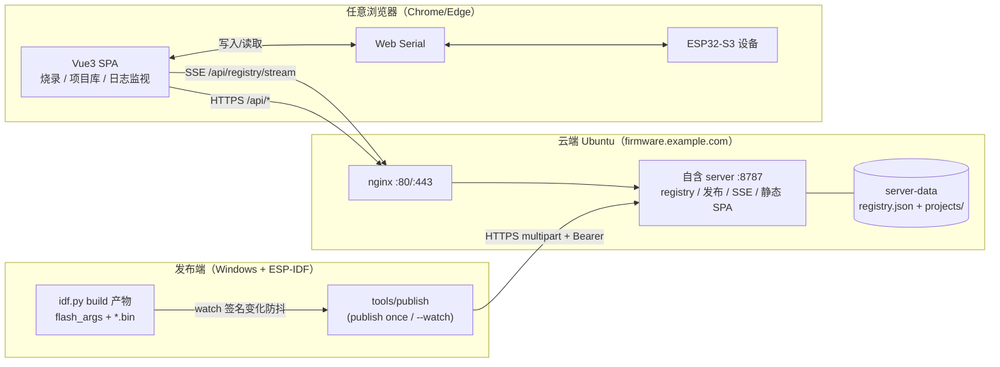
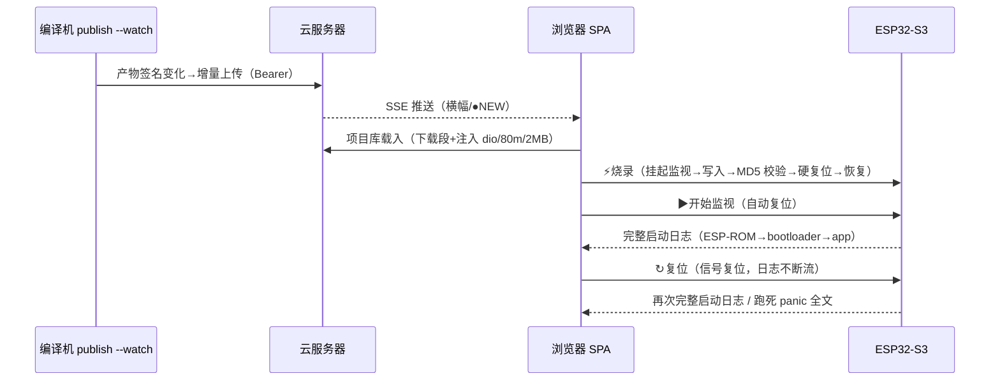

# ESP32 Web Flasher — 方案总览

> 浏览器里的 ESP32 固件烧录与日志工作站：**网页选固件 → 一键烧录 → 复位看全量启动日志**，配套跨设备固件库（发布/订阅/版本管理）。
> 单用户自用产品，官方 `esptool-js` 内核（只升不改），其余 UI/日志/服务全自研。
> 当前状态：**v1.5 核心关账（五道验收门全过）** + IDE 五区界面 + 监视对齐 `idf.py monitor`。

---

## 1. 一分钟了解

**解决什么问题**：没有 USB 线另一头的 IDE 也能完成"编译产物 → 烧录 → 验证日志"闭环——
编译机（Windows+IDF）把产物一键发布到云端，任意浏览器打开页面即可下载烧录、实时看日志、复位抓全量启动输出（含跑死现场）。

**三个入口**：

| 入口 | 地址 / 命令 | 用途 |
|---|---|---|
| 浏览器主站 | `https://firmware.example.com/`（自签证书信任一次） | 烧录 / 项目库 / 日志监视 |
| AI 只读通道 | `http://firmware.example.com/`（`/llms.txt` `/docs/`） | 机器可读文档 / 指南 |
| 本地开发 | `& $env:MIMO_NODE $env:MIMO_NPM run dev` → `localhost:5173` | 前端开发（API proxy 到 8787） |

## 快速开始（两类读者）

**① 我要使用页面烧录/看日志**（无需部署）：
- 环境：Chrome/Edge + HTTPS（或 localhost）+ USB 线
- 操作手册：**`docs/USER-GUIDE.md`**（三分钟上手 / 监视语义 / 抓全量启动日志与崩溃取证操作卡）
- 常见故障：`docs/TROUBLESHOOTING.md`

**② 我要自己部署一套**：
- 本机 5 分钟体验版（localhost 即安全上下文，Web Serial 可用）：见 `docs/DEPLOY.md` **§快速路径**
- 云服务器完整部署（nginx/SSE/token）：`docs/DEPLOY.md` 正文 + `docs/SERVER.md` 现状参考
- 发布端（编译机）接入：`docs/PUBLISH.md`

**当前核心能力**：

- 🔌 **设备**：Web Serial 连接（S3 原生 USB 优先）、芯片识别（MAC/Rev/Flash）、常驻连接、跨标签 Web Locks 互斥
- ⚡ **烧录**：手动选 bin / 项目库载入（地址+参数自动注入）、烧录前二次确认、D5 MD5 校验、自动硬复位
- 📁 **项目库**（v1.5）：远端 registry 三端架构，latest 载入、版本时间线（晋升/回滚/保留策略）、分区类型标注
- 📣 **订阅**：SSE 即时推送新发布（横幅/●NEW/★订阅），30s 轮询降级
- 📟 **日志监视（对齐 `idf.py monitor`）**：默认关闭手动开；**开启即自动复位**（从 ROM 第一行抓全启动日志）；**↻ 信号复位不断流**（端口不关、COM 不掉）；级别过滤 / 行号终端 / 暂停视图 / 导出
- ⬇ **导出固件包**：全部段 + `flash_args` + `README.txt` 打 zip（esptool 可离线直烧）
- 🎨 **界面**：b-ide 蓝本的 IDE 五区（活动栏/树形侧栏/标签工作区/底部面板/状态栏），日/夜主题，侧栏宽/面板高可拖拽

---

## 2. 总体架构（三端）



- **发布端**：`tools/publish`（零依赖纯 JS）解析 `flash_args`/assets → 校验查缺（sha 增量，跨 release 0 上传）→ multipart 发布；`--watch` 挂机自动发布
- **服务器**：`server/`（零依赖 `node:http`）registry 原子读写 / 发布鉴权（主 token+工作 token 双层）/ SSE 广播 / 静态托管；`systemd firmware-server`
- **浏览器**：官方 `esptool-js` 只在 `src/glue/` 接触，`src/core/` 纯逻辑零浏览器依赖（可单测）

---

## 3. 前端分层与扩展点

```
src/core/        纯逻辑（状态机 device / 日志 log / 错误 errors / 行切分 lines / zip / 固件包文本）
src/glue/        esptool-js + Web Serial 粘合（esptool / monitor / signalReset / deviceOps / deviceLocks）
src/composables/ useSession(接线) / useFirmwareWorkspace(烧录表格+项目库单例) / useServiceStatus
src/components/  业务面板 + ide/ 五区组件（ActivityBar/Sidebar/Tree*/EditorTabs/BottomPanel/StatusBar）
server/          自含服务（registry/publish/stream/releases/tokens）
tools/publish/   发布 CLI
```

**注册式扩展**（页面层面）：新工作区标签 = `workTabs` 加一行 + `#pane-<id>` 插槽；新侧栏节 = `<TreeSection>`+`<TreeItem>`；新活动栏图标 = `activityItems` 加一行；新底部标签 = `bottomTabs` 加一行。

**关键语义（改前必读）**：

| 语义 | 说明 | 守护 |
|---|---|---|
| 监视默认关（N4） | `streamWanted` 意图位：手动 ▶ 开启、跨重连保持、烧录临界区按意图恢复（手动暂停后烧录不抢串口） | `tests/device.test.ts` + DESIGN §4.1 |
| 监视对齐 idf monitor（R-1） | 开启监视=自动硬复位（抓全启动日志）；↻复位=RTS 信号时序（EN 低→5ms→释放），端口不关、日志不断 | 同上；时序源自本地 IDF `esp_idf_monitor` 源码 |
| 信号复位极性 | ⚠ `constants.py` 标签反转（LOW=True/HIGH=False）——**RTS=true=复位、RTS=false=释放**；抄官方源码必须连常量表一起抄 | `src/glue/signalReset.ts` 注释 |
| 日志渲染纪律 | seq 稳定 key / 120ms 批量 flush / 显示上限 500 / 暂停视图 | AGENTS 纪律 8 |
| esptool-js 只升不改 | 锁 0.7.0，import 仅限 `src/glue/` | AGENTS 纪律 1/2 |

---

## 4. 端到端流程

**发布 → 烧录 → 验证**（跨设备主流程）：



**抓全量启动日志的正确姿势**：连接 → ▶开始监视（自动复位即可）→ 需要再来一遍就点 ↻复位。串口无缓冲，**监视不在场的输出不可追回**——调试期建议监视常开。

---

## 5. 部署拓扑

```
Ubuntu 22.04 @ firmware.example.com
├─ nginx（宝塔）:80  → AI 只读通道（llms.txt / docs / registry GET）
│              :443 → 自签证书 → 反代 :8787（SSE flush_interval -1）
└─ systemd firmware-server → node server/index.js :8787
     /opt/firmware-server/{server, dist, server-data}
```

发布流程（**纪律 9：测试+build 全绿提交后自动发布**）：`build → Compress-Archive → scp → unzip → systemctl restart → 核对 ExecMainStartTimestamp 与入口 bundle`。
⚠ unzip 对 Windows zip 返回码 1（反斜杠警告）属正常，以目标文件存在为准。

---

## 6. 文档地图（按需取用）

**文档组织**：`docs/` = 现行文档；`docs/archive/` = 开发过程历史产出；`docs/research/` = 专题调研（现行参考）；
根目录仅保留 `README.md`（本文）、`AGENTS.md`（接手纪律）、`PROGRESS.md`（进度状态）。

| 我想… | 看 |
|---|---|
| **学习怎么用页面** | **`docs/USER-GUIDE.md`**（操作手册） |
| 理解架构与模块设计 | `docs/DESIGN.md`（10 章：状态机/日志/错误/UI 五区/部署） |
| 看需求与验收项（F-xx） | `docs/REQUIREMENTS.md` |
| 部署（本机快速路径 / 云） | `docs/DEPLOY.md` + `docs/SERVER.md` |
| 发布固件 | `docs/PUBLISH.md`（含裸 HTTP curl 示例） |
| 排查故障 | `docs/TROUBLESHOOTING.md` |
| v1.5 固件库设计 | `docs/FIRMWARE-REGISTRY.md` |
| 为什么选这个方案 | `docs/research/esp32-web-flash/REPORT.md` |
| 复位/监视能力依据（idf monitor 对齐） | `docs/research/serial-monitor-reset/REPORT.md` |
| 多用户托管方案调研（评估稿，未实现） | `docs/research/multi-user/README.md` |
| 了解当前进度 / 下一步 | `PROGRESS.md` |
| 接手改代码（纪律/命令） | `AGENTS.md` |
| 查开发过程历史（路线/选型/实测） | `docs/archive/README.md` |

公网文档站：`https://firmware.example.com/docs/`（源文件在 `docs/`，构建拷入 `public/docs/`——**改文档改 `docs/` 源头**）。

---

## 7. 版本与获取（Git 发布版）

每个发布版都是 **annotated tag**，版本描述写在 tag 说明里：

`ash
git tag -l -n99          # 列出所有版本及完整版本描述
git checkout v2.0.0      # 切到任意版本（只读查看）
git show v1.5.0          # 看该版本的详细描述与提交

# 快速拿到某版本的完整源码包（zip，无需克隆历史）：
git archive --format=zip -o esp32-web-v2.0.0.zip v2.0.0
`

| 版本 | 内容 | 对应 tag |
|---|---|---|
| **v2.0.0**（当前） | IDE 五区工作站 + 监视对齐 idf.py monitor + 文档体系 | 2.0.0 |
| v1.5.0 | 跨设备固件库（发布/SSE 订阅/版本管理，五道门全过） | 1.5.0 |
| v1.0.0 | 烧录工具核心（连接/烧录/日志/状态机，门2 真机通过） | 1.0.0 |

> 打算挂到 **GitHub/Gitee Releases**（网页一键下载 zip + 发布说明页）的话：建好远端仓库后把地址给我，我来推 tag 并生成 Release 说明（本地 tag/描述已就绪，推送即发布）。

---

## 8. 版本与状态

- **v1 核心**：烧录/擦除/复位/日志/错误翻译/S3 三层复位 ✅（F-01…F-18）
- **v1.5 固件库**：S1 最小闭环→S2 自动发布部署→S3 SSE 订阅→S4 版本管理，**五道验收门全过**（F-20…F-24）；S5 页面补充上传=可选不排期
- **体验层**：IDE 五区界面（b-ide 复刻）、监视对齐 idf monitor（N4/R-1）、导出固件包 ✅
- **Backlog**：watch 后台网络问题（问题20）、HTTPS 域名尾巴、S5、硬复位 esptool 路径细节（信号路径已覆盖主场景）

快速验证：`& $env:MIMO_NODE $env:MIMO_NPM test`（133 用例）+ `run build`（vue-tsc + vite）。
