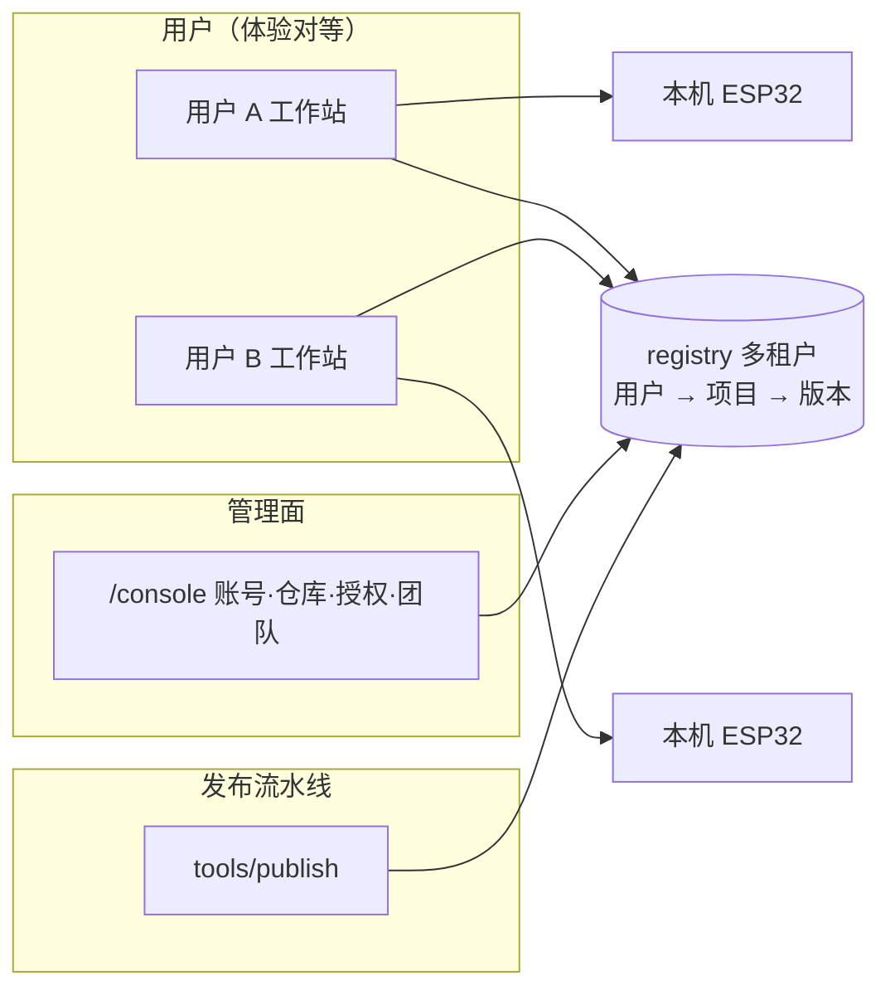

# 02 · 架构与站点结构

> 配套阅读：01-目标与产品边界.md · 03-身份仓库与权限.md  
> 关联现状：根目录 `DESIGN.md` / `FIRMWARE-REGISTRY.md` / `README.md`

---

## 1. 总原则

1. **工作站是产品本体**，不因多人化拆成两套 UI。  
2. **一套后端、一个域名**（阶段内），数据同源。  
3. **管理面与工具面分离呈现**（`/console` vs `/`），权限按路由组区分。  
4. **从 v1.5 演进**，不推倒 server 内核。

---

## 2. 站点结构三案对比

### 2.1 A · 全部整合

登录、发布管理、分享、下载、烧录全塞进现有 IDE。

| 优点 | 缺点 |
|---|---|
| 部署最省 | 下载/管理心智混乱 |
| 分享深链路径最短 | 账号模块把 IDE 撑大 |
| 与单体延续好 | 匿名页面里藏写操作，权限边界糊 |

**否决理由**：管理能力会污染工具；与「体验对等、工具纯粹」冲突。

### 2.2 B · 完全独立网站

另起「固件仓库控制台」站，与烧录工具分域名分部署。

| 优点 | 缺点 |
|---|---|
| 职责干净 | 两套前端/证书/运维 |
| 控制台可独立成长 | 分享后跳转割裂 |
| 工具攻击面小 | 小团队阶段过重 |

**否决理由**：与「简单、阶段可停」冲突；过早产品化。远期若控制台长成完整产品，可再拆。

### 2.3 C · 同域双门（采纳）

一套后端、一个域名：

| 门 | 位置 | 谁用 | 凭证 |
|---|---|---|---|
| 主门 = 工作站 | `/` 与深链 | 所有用户 | 登录态 / 授权 |
| 侧门 = 控制台 | `/console` | 发布者管理 | 账号会话 |

**注意**：讨论中曾把 C 的下载侧画成「分享码兑换页」，被否决。  
正确理解见 §3——**主门永远是完整工作站**。

---

## 3. 正确的产品结构

### 3.1 视图上的库来源

工作站侧栏项目库分组（示意）：

- **我的仓库** —— 可发布、可管理  
- **被授权 / 协作** —— 可载入烧录，权限看角色  
- **公开** —— 可载入烧录  

工具操作（烧录/擦除/日志/导出）对上述来源一视同仁。

### 3.2 深链

- `/`：工作台（按登录态显示可用库）  
- `/s/<code>` 或 `/p/<projectId>`：打开工作站并预载某项目（顺带能力）  
- `/console`：管理面  

深链进的仍是**完整工作站**，不是下载列表。

---

## 4. 与 v1.5 分层对齐（演进表）

| 层 | 现状 | 目标 | 改动量 | 说明 |
|---|---|---|---|---|
| `src/core` 状态机/日志 | 纯逻辑 | 不变 | 无 | 硬约束 |
| `src/glue` esptool/serial | 粘合层 | 不变 | 无 | 硬约束 |
| `src/components` IDE | 五区完整 | 几乎不动 | 小 | 侧栏库分来源；可能加登录壳 |
| `src/api` registry 客户端 | 单租户 API | 多租户 API | 中 | 路径带项目/身份 |
| `tools/publish` | Bearer 发布 | token 绑用户/仓库 | 小 | 兼容现有 meta |
| `server/` | 单租户 registry + 静态 token | 多租户 + 账号 + 权限 | **中–大** | 主工作量 |
| 存储 `server-data` | 扁平 projects/ | 按 userId/或 project 归属分层 | 中 | 保持原子读写 |
| 部署 | 单机 systemd + nginx | 平台托管 | 运维 | 域名/证书/备份 |

### 4.1 server 内核保留点

以下视为可复用资产，避免推倒：

- registry 原子读写
- multipart 发布 + sha 增量（`findPartBySha`）
- SSE hub / 轮询降级
- releases 时间线 / promote / retention
- 路径段白名单与前缀双检（安全）

新增层建议**外包**在入口（鉴权中间件 + 归属检查），而不是改写内核业务。

---

## 5. 安全边界（结构层面）

| 边界 | 要求 |
|---|---|
| 读接口 | 默认不公开；按项目可见性鉴权 |
| 下载直链 | 可签名/短时有效，防裸奔直链外泄 |
| 写接口 | 会话或 publish token，绑定用户与仓库 |
| SSE | 按可见性过滤推送 |
| 跨租户 | 服务端强制校验，禁止仅前端隐藏 |
| 密钥 | 主 token / 用户 token / 授权码语义分离，明文不入文档 |

> 史实提醒：2026-09-29 曾发生主 token 写入公网 `/docs/` 泄露。多人化后密钥管理必须是设计项。

---

## 6. 部署形态建议

| 阶段 | 形态 |
|---|---|
| P0–P1 | 现有 Ubuntu + nginx + systemd 扩展；仍是单机 |
| P2 | 先备份/监控/磁盘配额，再谈拆服务 |
| P3 | 真实域名 + 受信证书；国内备案另议 |

自签证书 + IP 只够内网/小圈子演示，不适合作为「托管服务」门面。

---

## 7. 反模式清单（讨论中已否决）

1. **下载访客残血 UI** —— 破坏体验对等。  
2. **首页 = 输分享码** —— 把授权工具抬成主路径。  
3. **为多人把日志/擦除藏起来** —— 能力属于产品本体。  
4. **独立第二站先上** —— 过早增加运维面。  
5. **用一套 token 包打天下** —— 运维 token、发布 token、用户授权必须语义分离。
