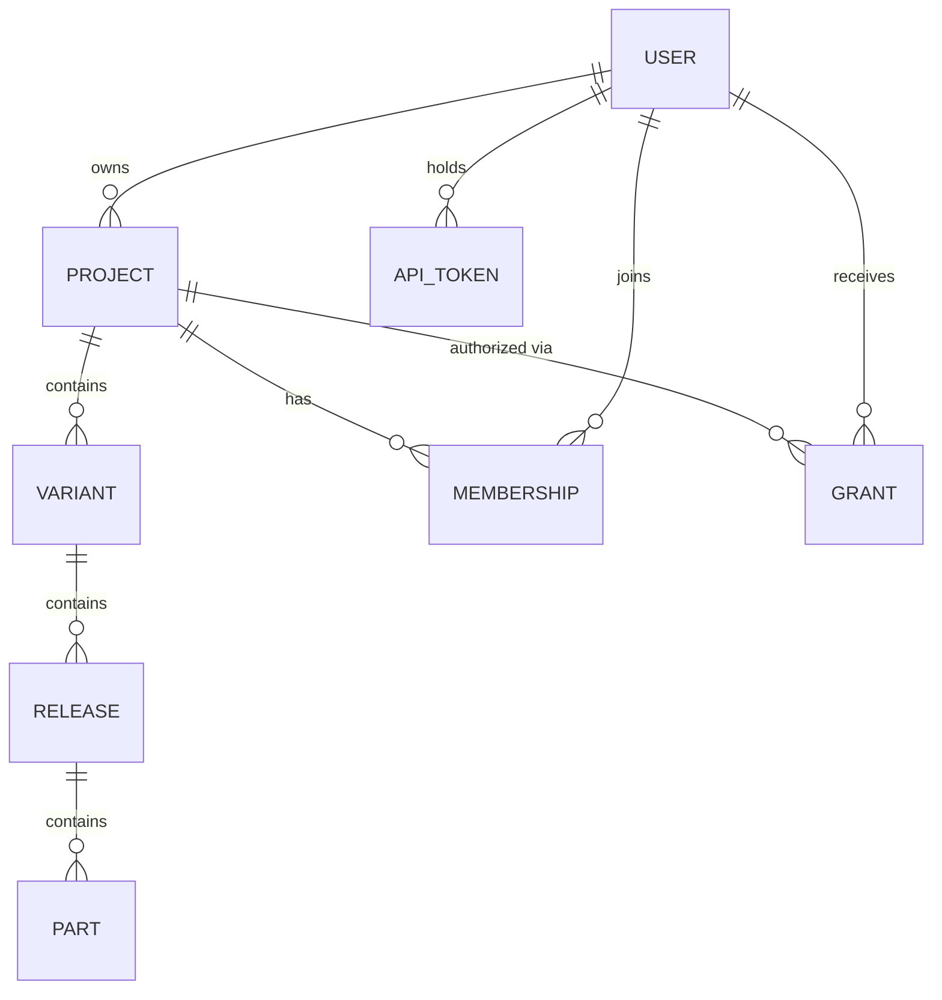

# 03 · 身份、仓库与权限

> 配套阅读：01-目标与产品边界.md · 02-架构与站点结构.md

---

## 1. 为什么需要「身份」（而不是可选）

讨论中曾希望「完全不账号」。结论：

> **身份语义不可少，账号产品形态可以轻。**

存在理由不是「管人」，而是：

1. **每人唯一仓库** —— B 发布的固件必须挂在 B 名下；  
2. **授权可指向** —— 私有库给谁用，要能表达「给谁」；  
3. **团队可扩展** —— 成员表需要主体；  
4. **审计可追溯** —— 谁在何时发布/晋升。

若坚持零主体，则只能做到「链接即钥匙」：  
分不清张三李四、出事只能整码作废、无法按人回收、无法做角色。  
这与「发布 + 下载双向体验对等」冲突。

### 1.1 形态可以轻（允许）

- 魔法链接 / OTP（无密码）  
- 一键 OAuth（如 GitHub）  
- 长寿命 API token（给编译机）

### 1.2 形态可以砍掉（不必须）

- 密码 / 找回密码  
- 完整个人中心、头像资料页  
- 注册营销页、用户等级

**口号**：砍账号的产品形态，不砍身份的语义。

---

## 2. 身份谱系（选型坐标）

| 强度 | 身份是什么 | 有无密码 | 适用 | 本项目角色 |
|---|---|---|---|---|
| L0 | 无 | 无 | 临时文件分享 | 不采用 |
| L1 | 分享码 / 能力链接 | 无 | 授权顺带 | **P1 辅助** |
| L2 | 邮箱魔法链接 | 无 | 轻账号 | **P0 候选** |
| L3 | API / publish token | 无 | 机器发布 | **P0 采用** |
| L4 | OAuth 社交登录 | 无 | 一键登录 | P0/P1 可选 |
| L5 | 注册+密码+资料 | 有 | 完整账号产品 | 避免；P3 再议 |

推荐组合：**L2 或 L4 做人的身份 + L3 做机器身份 + L1 做私有库授权**。

---

## 3. 概念模型



### 3.1 用户（User）

| 字段 | 说明 |
|---|---|
| id | 唯一主体 |
| identity | 邮箱 / OAuth subject（可多种登录绑定） |
| display_name | 展示名 |
| created_at | |

### 3.2 仓库 / 项目（Project）

| 字段 | 说明 |
|---|---|
| id | 项目 id（可沿用现有 pid） |
| owner_id | 归属用户（远期可改为 org） |
| name / slug | 展示与路径 |
| visibility | `private` / `internal`(授权) / `public` |

内部结构沿用现有：**Project → Variant → Release → Part**。

### 3.3 发布凭证（API / Publish Token）

| 字段 | 说明 |
|---|---|
| id | |
| user_id | 归属用户 |
| project_id? | 可限定到项目，或用户级 |
| prefix | 可识别前缀（如 `pk_`） |
| scopes | `publish` / `read` 等 |
| revoked_at | |

与现有 `tokens.js` 的「主 token / wk_ 工作 token」关系：

- **主 token**：服务器运维管理，永不入文档、不出现在产品 UI。  
- **wk_ 工作 token**：过渡期保留或迁移为「用户发布 token」。  
- **产品发布 token**：绑定用户/仓库，交给 `tools/publish`。

三者语义必须分离，不可一把 token 包打天下。

### 3.4 成员（Membership，P2）

| 字段 | 说明 |
|---|---|
| project_id | |
| user_id | |
| role | `owner` / `publisher` / `viewer` |
| invited_by | |
| created_at | |

### 3.5 授权（Grant / 分享，P1+）

| 字段 | 说明 |
|---|---|
| project_id | |
| grantee_id? | 已知用户（可选） |
| code_hash | 分享码/链接 token（可选） |
| role | 通常 `viewer` |
| expires_at / max_uses | |
| revoked_at | |

**分享码定位**：私有库授权的便捷入口；**不是**产品主路径。  
优先使用「可点击深链」；分享码作为链接被聊天工具截断时的找回手段。

---

## 4. 权限矩阵

| 动作 | 项目 owner | publisher | viewer（被授权） | 公开库访客 | 未授权他者 |
|---|---|---|---|---|---|
| 工作站烧录/擦除/日志/导出 | ✓ | ✓ | ✓ | ✓ | ✗ |
| 下载 bin / 载入版本 | ✓ | ✓ | ✓ | ✓ | ✗ |
| 发布（CLI） | ✓ | ✓ | ✗ | ✗ | ✗ |
| 晋升 / 回滚 / 保留 | ✓ | 可配 | ✗ | ✗ | ✗ |
| 生成/撤销授权链接 | ✓ | 可配 | ✗ | ✗ | ✗ |
| 改可见性 / 删项目 | ✓ | ✗ | ✗ | ✗ | ✗ |
| 邀请成员（P2） | ✓ | ✗ | ✗ | ✗ | ✗ |

要点：

1. **工具能力**（烧录、日志、擦除…）不随角色削减；角色只管「对这个库的管理权」。  
2. **服务端强制**；前端隐藏不是隔离。  
3. 公开项目 = 任何人可读可用（仍建议登录后有完整体验）。

---

## 5. 发布与下载路径

### 5.1 发布（对等）

```
用户登录 → 控制台生成 publish token → 写入编译机 CLI 配置
         → tools/publish --watch 发布到「自己的仓库」
```

与现在的差异只是：token 有主人，仓库有归属。

### 5.2 使用（对等）

```
登录工作站 → 侧栏见：我的 / 被授权的 / 公开的
           → 载入版本 → 连设备 → 烧录 / 日志 / 擦除 / 导出
```

与现在的差异只是：库来源变多。

### 5.3 私有库授权（分享码顺带在此）

```
owner 复制授权链接/码 → 发给 B → B 打开后侧栏出现该库
                      → 撤销后 B 不可见
```

---

## 6. 登录形态建议（P0）

| 方案 | 工作量 | 体验 | 备注 |
|---|---|---|---|
| 邮箱魔法链接 | 中 | 好 | 依赖邮件送达 |
| GitHub OAuth | 中 | 很好 | 开发者覆盖高，砍掉密码栈 |
| 邮箱 + 密码 | 大 | 一般 | 要找回/防撞库/锁账号；不推荐先做 |
| 邀请制预开号 | 小 | 受控 | 适合最早期内测 |

**倾向**：P0 用「邀请开号或魔法链接」，P1 起可加 OAuth。  
无论哪种，控制台之外的工作站主路径**不要**频繁打断登录。

---

## 7. 审计最小集

多人后至少记录：

- 发布：谁、哪个项目、哪个 release、时间  
- 晋升/回滚：谁、目标版本、note  
- 授权：谁生成/撤销、目标项目  
- 下载（可选）：谁/哪条授权、哪个 part  

审计目的：出问题能定位；不是做完整 SIEM。

---

## 8. 红线

1. 明文密钥（主 token、用户 token、分享码原文）**不入任何文档与仓库**。  
2. 文档、错误信息、SSE payload 不得回带密钥。  
3. 运维通道与产品通道隔离。  
4. 默认私有；公开是显式选择。
